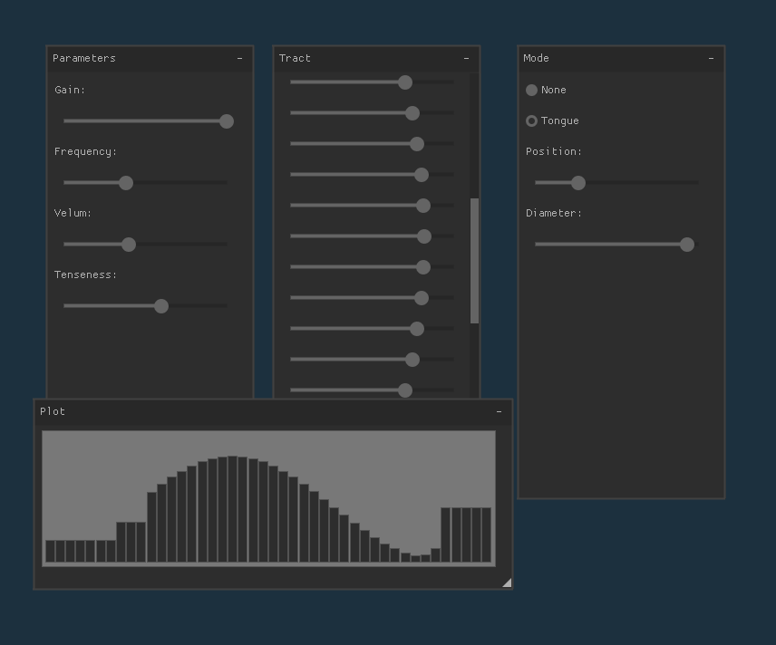

# Voc Demo

A realtime demo of [Voc](https://www.github.com/paulbatchelor/voc), a vocal 
tract physical model.

This is a simple voc demo using 
[RtAudio](https://github.com/thestk/rtaudio)
and 
[Nuklear](https://github.com/vurtun/nuklear).

## Setup

This demo has been tested on both Linux and Mac OSX. 

First, make sure that 
[Soundpipe](https://www.github.com/paulbatchelor/soundpipe) is installed.
Both Linux and OSX users will need to compile this from source.

This demo relies on the GLFW OpenGL2 backend for Nuklear, so make sure that
is properly configured and installed. On Linux, you'll install it through the
package manager in the usually way. On OSX, you can install it with 
"brew install glfw3".

After the dependencies have been installed, compile the demo with:

    make

Then run it with:

    ./voc_demo

